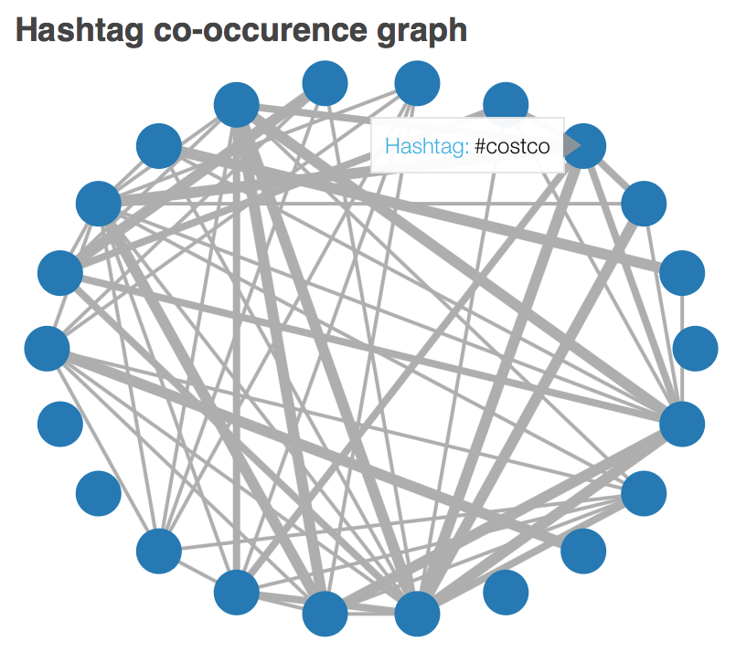
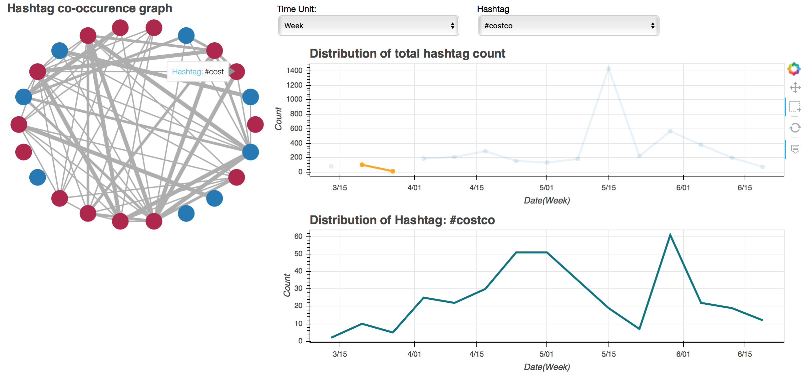
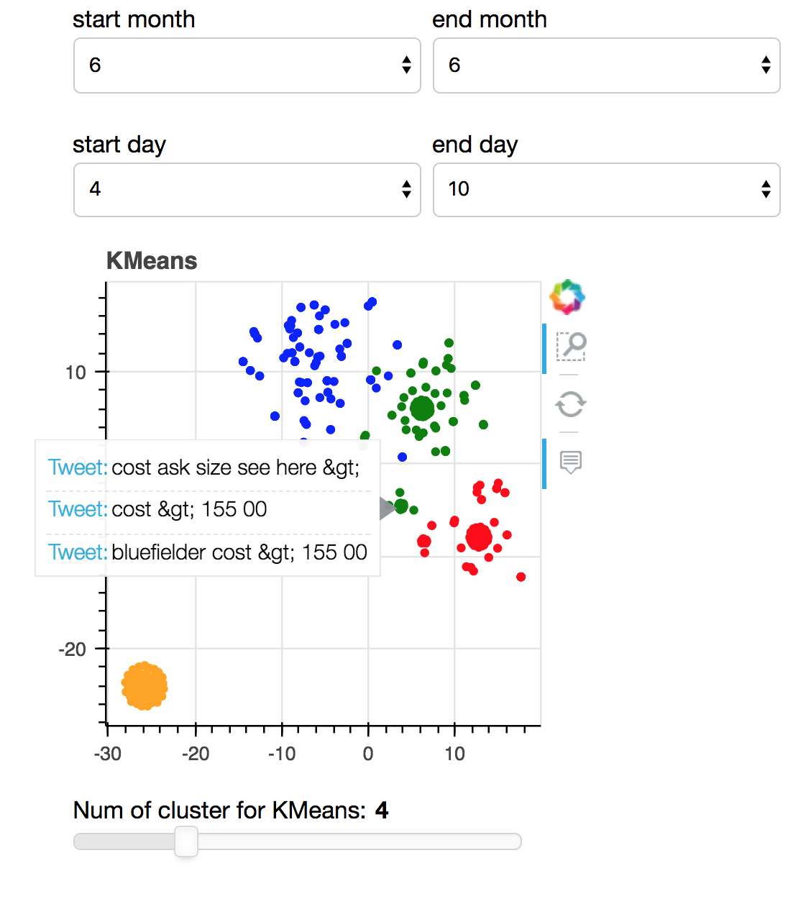

# Homework 6

**Team members**
1. Chao-Ching Chiang
2. Bailin Wang
3. Jin Zhang

**Datasets**

[Costco Wholesale Corp. Twitter Dataset](http://followthehashtag.com/datasets/nasdaq-100-companies-free-twitter-dataset/)

## Main Challenge
Since we pick VAST Challenge 2014: MC3 as our final project, we have to deveopled several analytics tools
to deal with streaming data. Our system must focus on time series analysis to identify upcoming events or
suspicious activities. The main problem we might have to solve is:
* how to identify upcoming or suspicious events ?

## Objective 1 - Analyze hashtags in tweets

### Concept

Hashtags often provide rich information of the tweets, such as locations, activities or organizations.
It is also easier for users to search relevant content using specific hashtags.
Thus, our first step is to analyze hashtags to get a clearer picture of what is going on in the tweets.
We wish to observe the distribution of hashtags to detect upcoming events.
Moreover, to better understand the relations between hashtags, we draw a co-occurence plot to visualize their
connections in the tweets. 

### Procedure

* Extract hashtags based on regular expression. (We set a threshold to extract the most frequent ones.)
* Then, we construct a weighted, undirected graph based on their co-occurence in the tweets to visualize their relations.
* Draw a time-series plot to observe the distribution of total count. The total count is the sum over all the 
hashtags, which also includes the less frequent ones.
* Finally, we plot a time-series distibution of the most frequent hashtags individually to detect the suspicious
events in each time period.

### Visualizaing Text

The co-occurenece graph reveals the relationships between hashtags. We also change the line width to
indicate the weights of each connections.
By hovering around the circle, we can clearly understand their relations.

The time-series plots can select time unit, such as 'Day', 'Week', or 'Month' to observe different distributions.
We can also select a specific hashtag to observe its distribution over time.
Both of the plots are connected to help visualization.

Users can also select a period of time on the time-series graph. If the hashtags in the co-occurence 
graph appeared in that period of time, the color of the circle will turn red.

Interactive version of it can be see running:

    bokeh serve --show hashtag.py

## Objective 2 - Analyze text in tweets
* package pandas,sklearn are required.
* bokeh server is used for visualization

Run the following command to generate the graph(may take a while)

    bokeh serve --show cluster.py

The basic strategy to detect events in tweets is to understand what's happening in a period of time from tweets. Hence, we develop an interactive visualization that consists of selecting time window and clustering algorithms to visualize these tweets. Other visualization techniques like hover tool, slider to select number of clusters are also employed here.

Note that update of the graph after selecting time window may take a while due to the large number of data we use.

### Text Preprocessing of twitter

* Remove all emojis and symbols at first
* Convert text to lower 
* URL links are removed
* User_names are removed
* Punctuations like #, !, /,\,are removed
* Tokenization by space

### Clustering

Each tweet is represented using word-count vectors based on Bag-of-Word model. Cluster algorithms of KMeans is employed. To visualize the high-dimensional vectors, t-sne is used to reduce the dimensionality to 2d so that they can be easily plotted.

### Explanation

Firstly, we select the time window of tweets. Then with the help of clustering and hover tool, we can easily infer some information from this visualization. For example, the green cluster shown in the graph above mainly talks about prices of products. 

We think this combination of visualization will be beneficial for detecting events in tweets.

