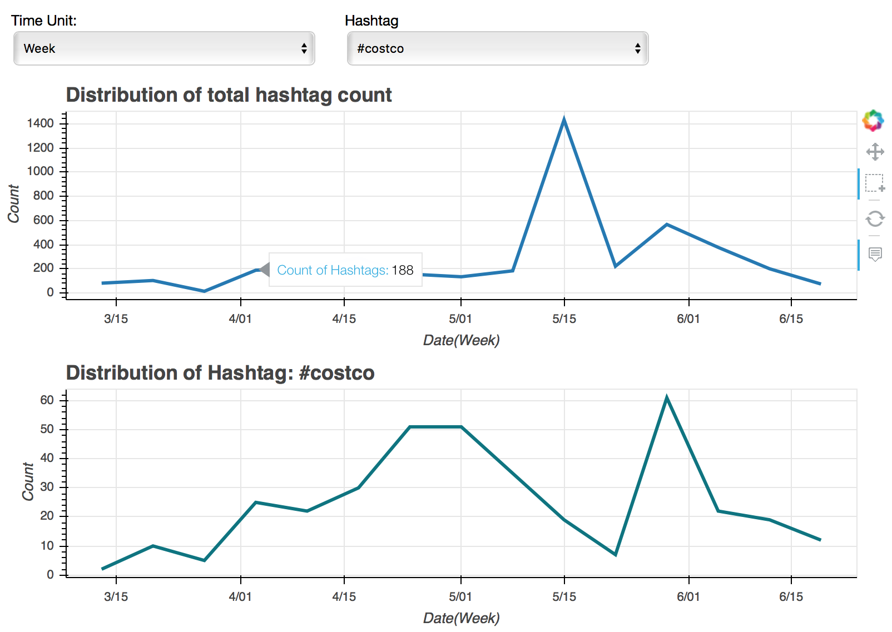

# Homework 6

**Team members**
1. Chao-Ching Chiang
2. Bailin Wang
3. Jin Zhang

**Datasets**

[Costco Wholesale Corp. Twitter Dataset](http://followthehashtag.com/datasets/nasdaq-100-companies-free-twitter-dataset/)

### Main Challenge
Since we pick VAST Challenge 2014: MC3 as our final project, we have to deveopled several analytics tools
to deal with streaming data. Our system must focus on time series analysis to identify upcoming events or
suspicious activities. The main problem we might have to solve is:
* how to identify upcoming or suspicious events ?

## Objective 1 - Analyze hashtags in tweets

### Concept

Hashtags often provide rich information of the tweets, such as locations, activities or organizations.
It is also easier for users to search relevant content using specific hashtags.
Thus, our first step is to analyze hashtags to get a clearer picture of what is going on in the tweets.
We wich to observe the distribution of hashtags to detect upcoming events.
Moreover, to better understand the relations between hashtags, we draw a co-occurence plot to visualize their
connections in the tweets. 

### Procedure

* Extract hashtags based on regular expression.
* Draw a time-series plot to observe the distribution of hashtags. In this homework, we only explore the total count of
hashtags in a period of time. To get more information from the graph, we intend to draw the distribution of 
some important hashtags in the future.
* We construct a weighted, undirected graph based on their co-occurence in the tweets to visualize the relations between
hashtags. 

### Visualizaing Text

We only onstruct the co-occurenece graph based on the hashtags with high frequency in the tweets.
Then, we plot a time-series graph to observe the distribution of all the tweets.
The graph can select time unit, such as 'Day', 'Week', or 'Month' to observe different distributions.
Users can select a period of time on the time-series graph. If the hashtags in the co-occurence 
graph appeared in that period of time, the color of the circle will turn red.

Interactive version of it can be see running:

    bokeh serve --show main.py
        
(ps. Note that it might take a few minutes to read in the dataset.)

## Objective 2 - Analyze text in tweets
* package wordcloud is required.

### Text Preprocessing 

* Remove all emojis and symbols at first
* Convert text to lower 
* URL links are removed
* User_names are removed
* Punctuations like #, !, /,\,are removed
* Remove numerical numbers  
* Tokenization by space

### Visualizaing Text

**word cloud**

Shown in wordcloud.ipynb

 * Compare worldclouds between raw text & preprocessed text--Textpreprocessing changes high\_frequency words in tweets
 * Reduce parameter max_font_size to see more high_frequency words 
 * Verify high\_frequency words by changing max_words values  
 * Add stopwords
 * Show worldcloud in different shapes
 

**ranking word**
Here we rank the tokenized word using tf-idf with threshold 0.001. Run the script tfidf.py and a plot blow will be generated.

### Clustering

Each tweet is represented using a word-count vectors.Basically, two cluster algorithms KMeans and Birch are employed. To visualize the high-dimensional vectors, t-sne is used to reduce the dimentionality to 2d so that they can be easily plotted.

Run the following command to generate the graph(may take a while)

	bokeh serve --show cluster.py

**visualization**
Slide bars of adjusting the number of clusters are embedded for interactive visualization. Tweets are visible through hover tool.

### Explanation

* As we may see from the following example graph, two clusteing algorithms acheives similar results in terms of generated clusters.

* Meanwhile, Bag of Word model yields good performance of representing tweets in vector. For example, the tweets in most left clusters are mainly talking about advertivesements and most of them share similar vocabulary.

