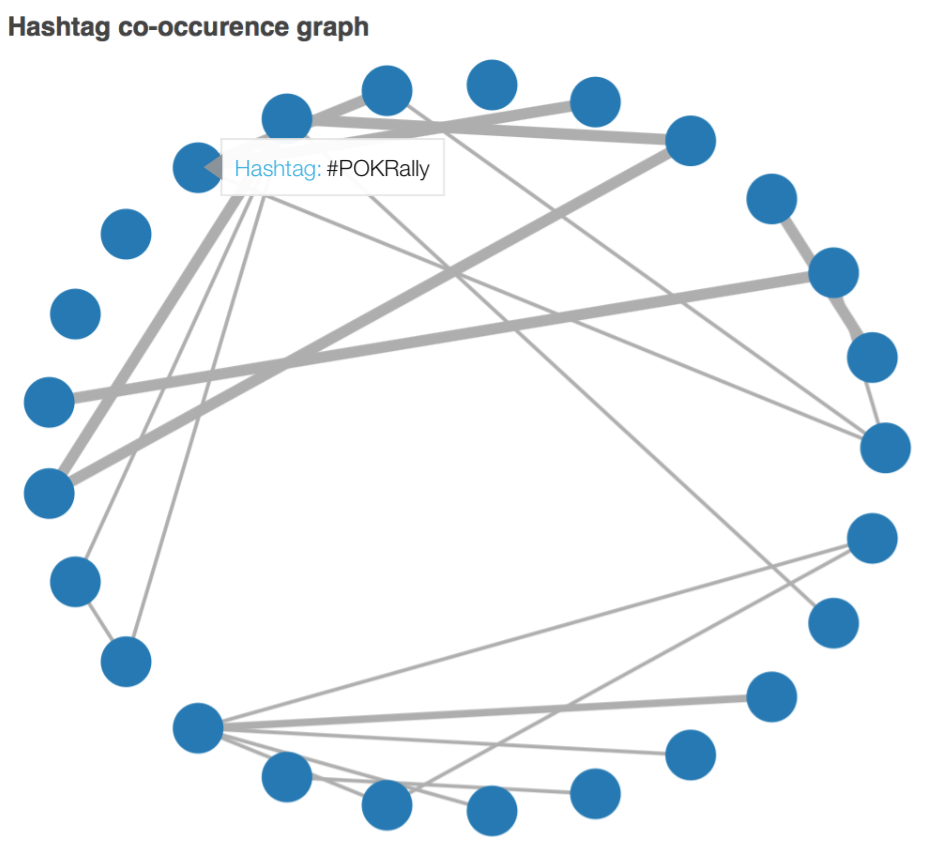
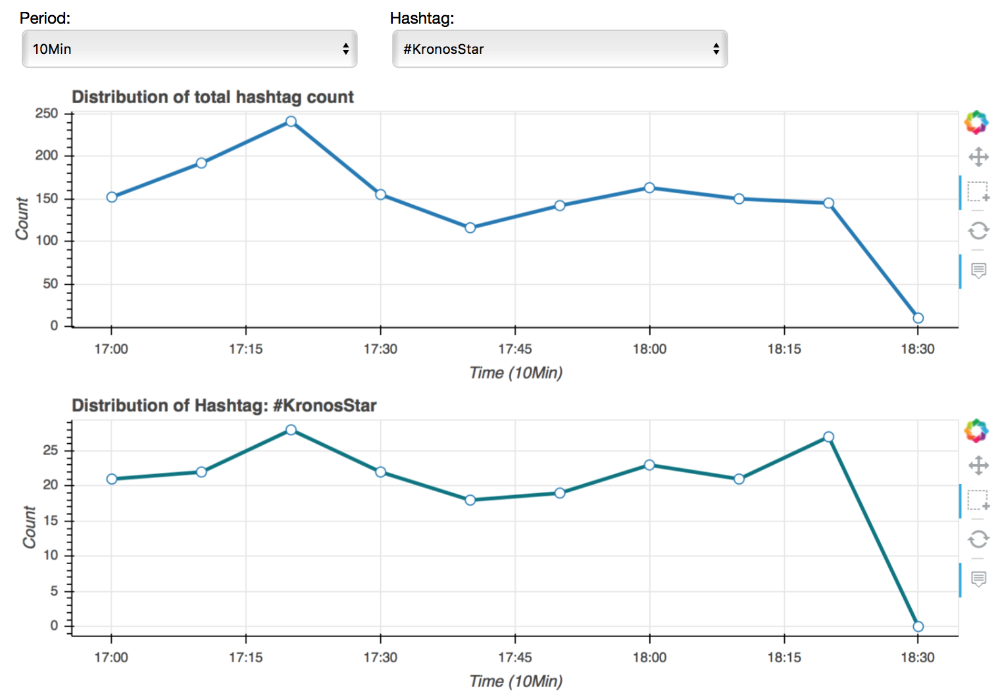
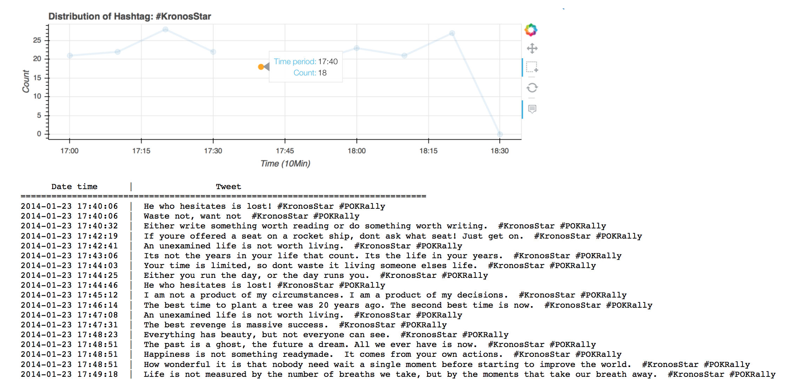
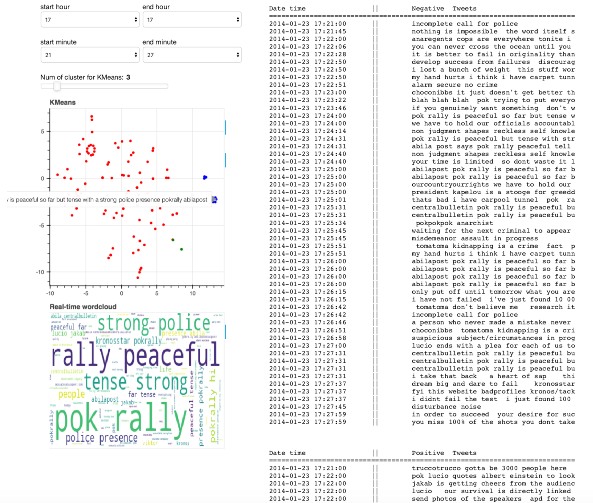
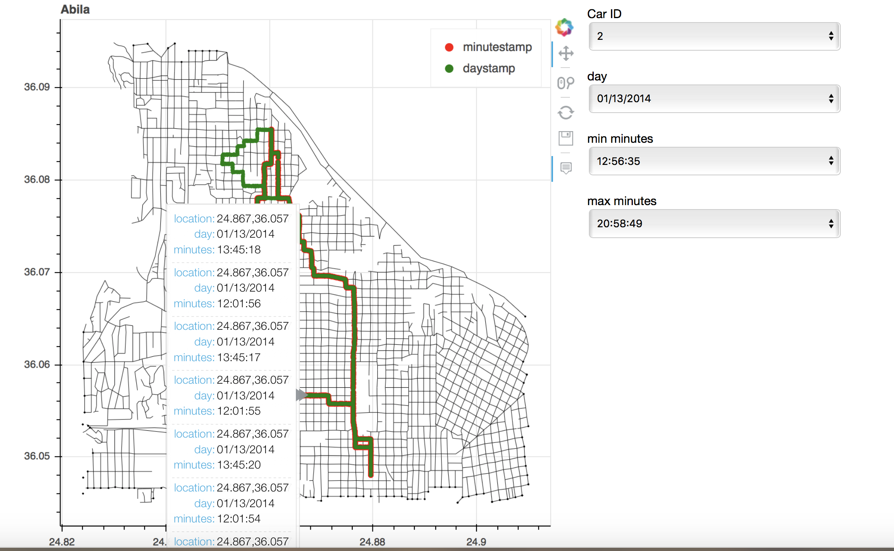

# Homework 7

### Team members
1. Chao-Ching Chiang
2. Bailin Wang
3. Jin Zhang

### Dataset
* [VAST Challenge 2014 MC2](http://www.vacommunity.org/VAST+Challenge+2014%3A+Mini-Challenge+2)
* [VAST Challenge 2014 MC3](http://www.vacommunity.org/VAST+Challenge+2014%3A+Mini-Challenge+3)

## Main Challenge
Since our team pick **VAST Challenge, 2014** as our final project, we have to develop several analytics tools to deal with text, map and streaming data. Our system must focus on time series analysis to identify upcoming events or suspicious activities. One of the main problems we have to solve is: **"How to identify upcoming events or suspicious activities?"**

## Objective 1 - Analyze hashtags in tweets

### Concept

Hashtags often provide rich information of the tweets, such as locations, activities or organizations.
It is also easier for users to search relevant contents using specific hashtags.
Thus, our first step is to analyze hashtags to get a clearer picture of what is going on in the tweets.
We aim to observe the distribution of hashtags to detect upcoming events. For instance, if a specific hashtag only appeared in a short period of time, we can look into that period of time and investigate.

Moreover, to better understand the relations between hashtags, we draw a co-occurence plot to visualize their connections in the tweets. 

### Procedure

* Extract hashtags based on regular expression.
* Construct a weighted, undirected graph based on their co-occurence in the tweets to visualize their relations.
* Draw a time-series plot to observe the distribution of total counts of hashtags.
* Draw another time-series plot to show the distribution of the selected hashtag.
* Design a tool which can filter the tweets based on hashtags.

### Visualization

First, we extract hashtags from our dataset and count their co-occurence.
The co-occurenece graph reveals the relationships between hashtags. We also change the line width to
indicate the weights of each connections.
By hovering around the circle, we can clearly understand their relations.

For example, in the VAST dataset, **#POKRally** and **#KronosStar** are highly correlated. Thus, we will have the sense that these two words have some relations in the tweets.

Next, we plot the distribution of total count of hashtags. The time-series plots can select time period, such as '10Min', '15Min', or 'Hour' to observe different distributions of the counts.
We can also select a specific hashtag which we are interested in to observe its distribution over time.
Both of the plots are connected to help visualization.

Moreover, we want to use hashtags as filter to search specific tweets. When we are detecting suspicious event, we may want to find all the tweets related to that certain topic or situation to really understand what happened.
Thus, in the second(below) time-series plot, when we select a hashtag and certain range of time period, we will show the tweets 
that include the selected hashtag in the text area.
User can therefore look into the tweets and make further investigation.

### Difference between VAST and Midterm dataset
This mini-challenge 3 separates the entire dataset into three segments. We only got the first segment; therefore, the size of the dataset is limited.
When we draw the co-occurence plot, the connection is sparse.

Moreover, in the VAST dataset, the distribution of specific hashtag tends to be uniform (perhaps we only observe a short range of time). It is not easy and obvious to detect certain event.

However, we can still observe that **#POKRally** related words are important using our tools.

### Code
Run the following command to visualize the interactive plots:

    bokeh serve --show hashtag.py

## Objective 2 - Text clustering & Sentiment Analysis of Tweets
* package pandas, sklearn, wordcloud are required.
* bokeh server is used for visualization

Run the following command to generate the graph (may take a while)

    bokeh serve --show cluster.py

The basic strategy to detect events in tweets is to understand what's happening in a period of time from tweets. Hence, we develop an interactive visualization that consists of selecting time window and clustering algorithms to visualize these tweets. Other visualization techniques like hover tool, slider to select number of clusters are also employed here.

Note that update of the graph after selecting time window may take a while due to the large number of data we use.

### Components

#### Text Preprocessing of Tweets

* Convert text to lower 
* Punctuations like #, !, /,\,are removed
* Tokenization by space

#### Clustering

Each tweet is represented using word-count vectors based on Bag-of-Word model. Cluster algorithms of KMeans is employed. To visualize the high-dimensional vectors, t-sne is used to reduce the dimensionality to 2d so that they can be easily plotted.

A slider is used for interactively tuning the number of clusters. Hover tool is also employed such that we can directly see the tweet that each plot represents.

#### Sentiment Analysis

This component is expected to capture sentiment underlying tweets, which could be beneficial for detecting events. We use a naive sentiment classification strategy that if any word in tweet triggers a sentiment lexicon, then it's recognized as positive/negative. Then those tweets with sentiment polarity are filtered to be shown in the visualization. 

#### Word Cloud

Word cloud is also added to capture some keywords.

### Time Window

Note that every component above only shows the tweets that were sent in a specific time range, which is determined by the time value we select. The purpose of this design is that we can easily switch between different time windows since events often happen in a particular time period.

### Event

We found that from 17:00, POK rally took place at Abila City Park. It could be easily detected through the word cloud since these words are frequently used since that time. 

The clustering helps us focus on the tweets that talk about pok rally. And we can use the zoom tool to look into each cluster in detail. For example, as shown in the image above, we found an event that this rally leads to a heavy police presence. From the negative tweets on the right, we can also find that people are also worried about potential security risks.

As we push forward the time window, we can also easily detect the events that happen in the rally, such as introducing guests and music show. The rally remains peaceful till the end without unexpected events occurring.

## Objective 3 - Analyze pattern on map
* package geopandas is required
* package pyshp is require

Run the following command to visualize the interactive plots:

    bokeh serve --show geo.py

In order to make sense of data and identify suspicious patterns, we need to show routines for GAStech employees on the Abila map. To begin with, we read in .shp file,transfer linestrings into dataframe and draw Abila map in bokeh. Then we plot routines of GAStech employees on the Abila map in bokeh, in which the green line represents the whole day routine while the red routine represent the period routine.

The datasets include two weeks routines for each GAStech employees, which are elaborated in seconds. By analyzing routines between different days or hours or minutes of GAStech employees, we can conclude the suspicious patterns.

