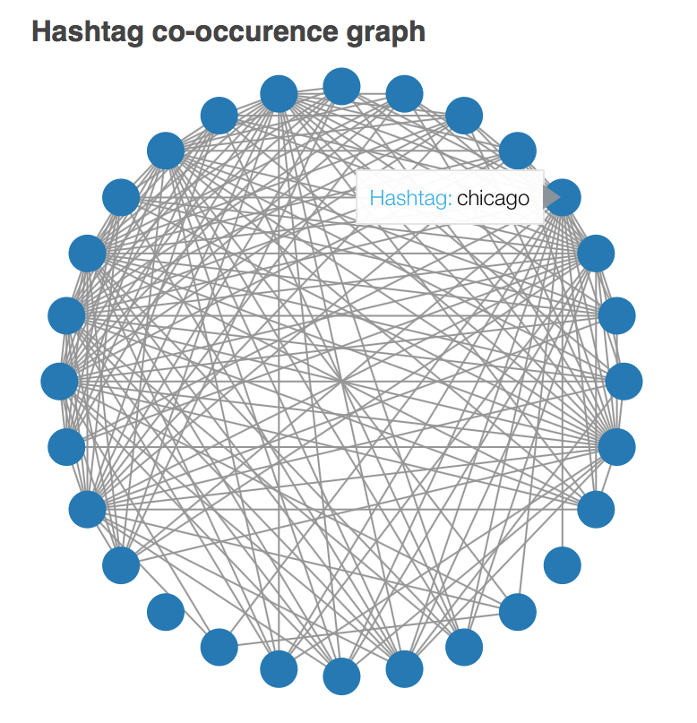
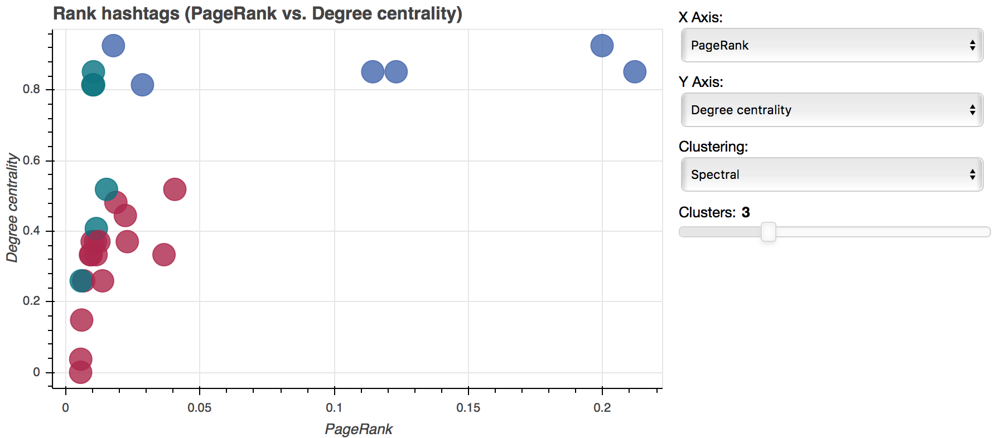

# Midterm

**Team members**
1. Chao-Ching Chiang
2. Bailin Wang
3. Jin Zhang

**Datasets**

[USA Geolocated Twitter dataset](http://followthehashtag.com/datasets/free-twitter-dataset-usa-200000-free-usa-tweets/)

## Objective 1 - Analyze hashtags in tweets

* package sklearn is required.
* package networkx is required.

Out first goal it to analyze hashtags in tweets and rank them using different metrics.

### Preprocessing

* Extract hashtags based on regular expression.
* We only care about important hashtags. Thus, we set a threshold for the count of hashtags so that we can observe the most influential ones.
* Then, we construct a weighted, undirected graph based on their co-occurence in the tweets.

### Visualizaing Text

After we construct the co-occurenece graph, we apply several network analysis metrics to evaluate the importance of these hashtags:
* Weighted PageRank
* Degree centrality
* Closeness centrality
* Betweenness centrality

### Clustering

These scores were treated as the features of the hashtags. Then, we use K-means and SpectralClustering algorithm to cluster the hashtags. We build an interactive scatter plot to visualize our results.

Interactive version of it can be see running:

    bokeh serve --show hashtag.py
        
(ps. Note that it might take a few minutes to read in the dataset.)

### Explanation

* For hashtag analysis, if we set PageRank as the ground truth of the importance of hashtags, we can observe that "job" and "hiring" are the most important hashtags in this dataset. These two hashtags also have high degree centrality, which means that they often come together with other important hashtags.

* However, by observing degree centrality and PageRank, we notice that high degree centrality does not guarantee to have high PageRank score. In the dataset, "Chicage", "Houston", and "LosAngeles" have high degree centrality but low PageRank score. Perhaps these hashtags are just indicating the locations of the users, but not giving imporant information of the tweets.

## Objective 2 - Analyze text in tweets
* package wordcloud is required.

### Text Preprocessing 

* Remove all emojis and symbols at first
* Convert text to lower 
* URL links are removed
* User_names are removed
* Punctuations like #, !, /,\,are removed
* Remove numerical numbers  
* Tokenization by space

### Visualizaing Text

**word cloud**

Shown in wordcloud.ipynb

 * Compare worldclouds between raw text & preprocessed text--Textpreprocessing changes high_frequency words in tweets
 * Reduce parameter max_font_size to see more high_frequency words 
 * Verify high_frequency words by changing max_words values  
 * Add stopwords
 * Show worldcloud in different shapes

**ranking word**
Here we rank the tokenized word using tf-idf with threshold 0.001. Run the script tfidf.py and a plot blow will be generated.

### Clustering

Each tweet is represented using a word-count vectors.Basically, two cluster algorithms KMeans and Birch are employed. To visualize the high-dimensional vectors, t-sne is used to reduce the dimentionality to 2d so that they can be easily plotted.
run the following command to generate the graph(may take a while)

	bokeh serve --show cluster.py

**visualization**
Slide bars of adjusting the number of clusters are embedded for interactive visualization. Tweets are visible through hover tool.

### Explanation

* As we may see from the following example graph, two clusteing algorithms acheives similar results in terms of generated clusters.

* Meanwhile, Bag of Word model yields good performance of representing tweets in vector. For example, the tweets in most left clusters are mainly talking about advertivesements and most of them share similar vocabulary.

